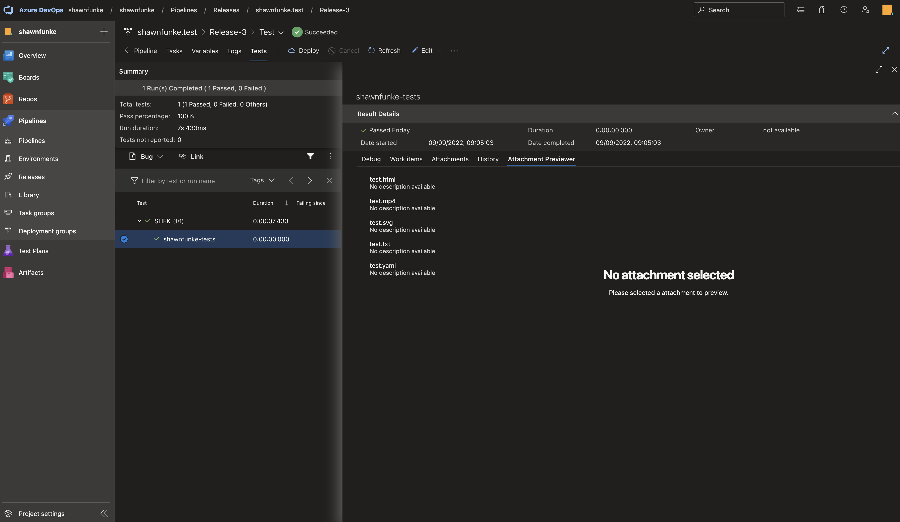
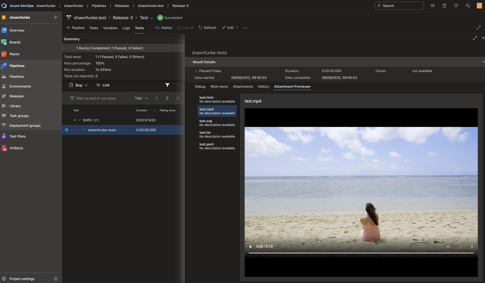

# attachment-previewer

## Overview

A Azure DevOps extension for previewing a number of files directly inside of
Azure DevOps without downloading it. Works for both the Azure DevOps Server and
Azure DevOps Services.

## Usage

Attachments for tests inside of releases can be previewed, for this a test case
needs to be selected, there the `Attachments Previewer` tab will allow the user
to preview attachments.





## Development

```bash
npm install
```

> Install all required dependencies.

```bash
npm run test
```

> Create a development build of the extension.

```bash
npm run build:dev
```

> Create a development build of the extension.

## Testing

A C# unit-test project can be used to test the extension in a self-owned Azure
DevOps organisation.

```csharp
[TestClass]
public class UnitTests
{
    public TestContext? TestContext { get; set; }

    [TestCleanup]
    public void TestCleanup()
    { 
        this.TestContext!.AddResultFile("./attachments/test.svg");
        this.TestContext!.AddResultFile("./attachments/test.mp4");
        this.TestContext!.AddResultFile("./attachments/test.html");
        this.TestContext!.AddResultFile("./attachments/test.pdf");
        this.TestContext!.AddResultFile("./attachments/test.yaml");
        this.TestContext!.AddResultFile("./attachments/test.txt");
        this.TestContext!.AddResultFile("./attachments/fake.pdf");
    }

    [TestMethod]
    public void TestMethod_Pass()
    {
        Assert.AreEqual("abc", "abc");
    }

    [TestMethod]
    public void TestMethod_Fail()
    {
        Assert.AreEqual("abc", "123");
    }
}
```

> Example unit-test class that uploads the release pipeline attachments.

```yaml
steps:

- task: VisualStudioTestPlatformInstaller@1
  displayName: 'Install Visual Studio Test Platform'
  inputs:
    versionSelector: latestStable

- task: NuGetToolInstaller@1
  displayName: 'Use NuGet'
  inputs:
    checkLatest: true

- powershell: |
   New-Item -ItemType Directory -Force -Path $(System.DefaultWorkingDirectory)\_ado-attachment-previewer-tests\test-project\attachments

   Invoke-WebRequest "https://filesamples.com/samples/image/svg/sample_640%C3%97426.svg" -OutFile $(System.DefaultWorkingDirectory)\_ado-attachment-previewer-tests\test-project\attachments\test.svg
   Invoke-WebRequest "https://filesamples.com/samples/video/mp4/sample_960x540.mp4" -OutFile $(System.DefaultWorkingDirectory)\_ado-attachment-previewer-tests\test-project\attachments\test.mp4
   Invoke-WebRequest "https://filesamples.com/samples/code/html/sample1.html" -OutFile $(System.DefaultWorkingDirectory)\_ado-attachment-previewer-tests\test-project\attachments\test.html
   Invoke-WebRequest "https://filesamples.com/samples/document/pdf/sample3.pdf" -OutFile $(System.DefaultWorkingDirectory)\_ado-attachment-previewer-tests\test-project\attachments\test.pdf
   Invoke-WebRequest "https://filesamples.com/samples/code/yaml/invoice.yaml" -OutFile $(System.DefaultWorkingDirectory)\_ado-attachment-previewer-tests\test-project\attachments\test.yaml
   Invoke-WebRequest "https://filesamples.com/samples/code/yaml/invoice.yaml" -OutFile $(System.DefaultWorkingDirectory)\_ado-attachment-previewer-tests\test-project\attachments\test.txt

   Invoke-WebRequest "https://filesamples.com/samples/code/html/sample1.html" -OutFile $(System.DefaultWorkingDirectory)\_ado-attachment-previewer-tests\test-project\attachments\fake.pdf
  displayName: Setup

- task: NuGetCommand@2
  displayName: 'NuGet Restore'
  inputs:
    restoreSolution: '$(System.DefaultWorkingDirectory)/_ado-attachment-previewer-tests/test-project/test-project.sln'

- task: MSBuild@1
  displayName: 'Build Solution'
  inputs:
    solution: '$(System.DefaultWorkingDirectory)/_ado-attachment-previewer-tests/test-project/test-project.sln'
    msbuildArchitecture: x64

- powershell: |
   Move-Item $(System.DefaultWorkingDirectory)\_ado-attachment-previewer-tests\test-project\attachments $(System.DefaultWorkingDirectory)\_ado-attachment-previewer-tests\test-project\bin\Debug\net6.0\attachments
  displayName: 'Move Attachments'

- task: VSTest@2
  displayName: 'Run Visual Studio Tests Without Reruns'
  inputs:
    testAssemblyVer2: '**\test-project.dll'
    searchFolder: '$(System.DefaultWorkingDirectory)\_ado-attachment-previewer-tests\test-project'
    vsTestVersion: toolsInstaller
  continueOnError: true

- task: VSTest@2
  displayName: 'Run Visual Studio Tests With Reruns'
  inputs:
    testAssemblyVer2: '**\test-project.dll'
    searchFolder: '$(System.DefaultWorkingDirectory)\_ado-attachment-previewer-tests\test-project'
    vsTestVersion: toolsInstaller
    rerunFailedTests: true
    rerunType: basedOnTestFailureCount
  continueOnError: true

- task: PublishTestResults@2
  displayName: Publish
  inputs:
    testResultsFormat: NUnit
    testResultsFiles: testresult.xml
    searchFolder: '$(Agent.TempDirectory)/TestResults'
  continueOnError: true
```

> Exported YAML of steps for release pipeline. Requires the git repository that
> includes the C# unit-test project as an artifact.

## Maintainers

  - [@shawnfunke](https://github.com/shawnfunke)
